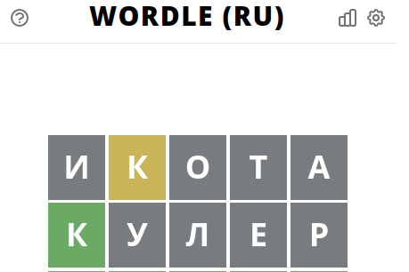
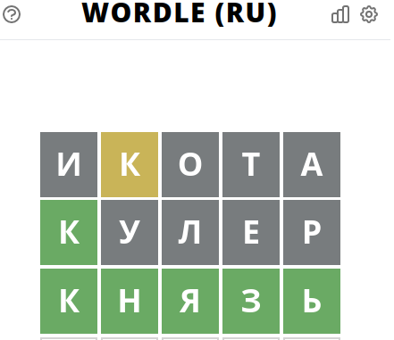

Wordle solver
===

This is solver for wordle game ([rus](https://wordle.belousov.one/), [eng](https://wordle.one/)). In this game you should guess 5 letter word in 6 steps using some tips.

## How to use

1. First, you will need words database. For russian version of game I **already found** a lot of 5 letter words and put it in `rus-words-5.txt` file.
2. Second, put you current progress in `state` file using the following format: 

Each line contains information about 1 round and consist of 2 words. The first word is the word you have written in wordle. The second word is result of round, where letter **G** means **green** letter, **B** means **black** letter, **Y** means **yellow** leter. 


### Example:

+ result from wordle:



+ `state` file:
```
ИКОТА BYBBB
КУЛЕР GBBBB
```

3. Run python script

```console
$ python main.py --words ./rus-words-5.txt --state ./state
['князь']
```

Choose the most appropriate word for you and enjoy the win!




